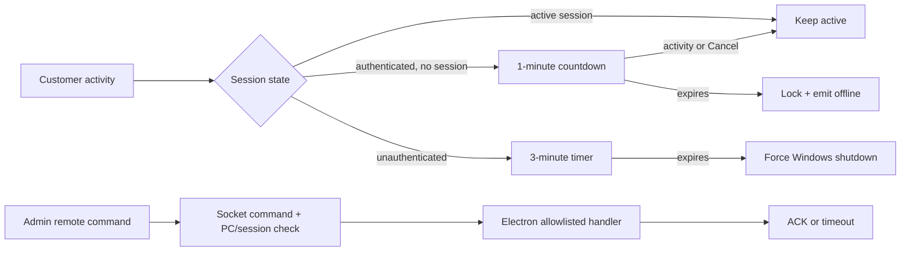

# Review Fixes: Presence, Idle Shutdown, and Modal Requests

This is the single implementation guide for the latest whole-codebase review covering the Admin app, Customer app, Electron station, backend, and Socket.IO wiring.

## Product decisions

- Login persistence uses the server-backed auth session and restores only while the session is valid and bound to the same registered PC.
- A new login replaces the previous login for that member. The previous auth session is revoked and its sockets are disconnected immediately.
- Unauthenticated inactivity: after 3 minutes, force Windows shutdown with `shutdown.exe /s /f /t 0`.
- Authenticated with no active session: after 1 minute, show a compact cancellable countdown. When it expires, lock the station and report it idle/offline; do not power off.
- Authenticated with an active session: no idle shutdown.
- Earnings is a complete workflow: sales, expenses, tax/reporting, period filters, and PDF export. Default tax is 8% and configurable.

## Findings requiring fixes

### Presence, shutdown, and security

1. **Guest sockets are not associated with a PC.** Anonymous customer sockets bypass the backend disconnect guard, so a closed guest station can remain online or occupied in Admin.
2. **Socket presence is not strongly station-bound.** A valid customer token can connect from another station unless the handshake is checked against the registered PC identity.
3. **Socket authentication is one-time only.** A revoked or expired token can retain room membership until transport disconnects.
4. **Idle handling only locks the UI.** The current login timer does not implement the selected power-off/lock policy or reliably report presence.
5. **Remote shutdown is not end-to-end.** The backend emits `remote:command`, but Electron lacks a complete listener, execution path, acknowledgement, and timeout fallback.
6. **Client identity headers can be spoofed through a trusted localhost proxy.** `X-Aezakmi-Client-IP` must only be accepted from the trusted Electron bridge.
7. **Credential changes do not revoke existing sessions.** Password changes must invalidate previous auth sessions and sockets.
8. **Support history is too broad.** `member_id OR pc_id` can expose another customer’s messages on the same PC; history must be scoped to the current member/session.

### UX and data

9. **Extension failures render as success.** Both Admin and Customer treat `{ ok: false }` as a successful result object.
10. **Bulk actions can be submitted repeatedly.** Top-up and power operations need busy state, disabled controls, and idempotent requests.
11. **Bulk Add PC can partially create an invalid range.** Validate the complete IPv4 range before mutation and use an atomic backend operation where possible.
12. **Add PC and Bulk Add remain coupled to the IP-prefix setting.** Both must accept complete IP addresses independently.
13. **Modal behavior is inconsistent.** All modals need Escape, Enter, internal scrolling, body-scroll locking, focus restoration, and a high overlay layer.
14. **PC action menus are centered instead of mouse-anchored.** Menus must open near the clicked card and clamp to the viewport.
15. **Customer session state can disagree with presence.** Temporary offline events must not erase a valid session or timer; show reconnecting/offline state separately.
16. **Earnings navigation and totals are incomplete.** Breadcrumbs are hardcoded to Overview and revenue currently infers totals from arbitrary logs, including refunds and wallet adjustments.

## Implementation plan

### Auth persistence and takeover

- Restore stored tokens through a server validation endpoint before rendering the dashboard.
- Include an auth-session identifier and PC binding in the session/token contract.
- On new login, atomically revoke the previous member session, emit `auth:revoked`, disconnect its sockets, and publish the PC transition.
- Periodically validate socket sessions and disconnect revoked or expired sockets.
- Revoke all sessions after credential changes.
- Restrict client identity headers to the trusted Electron IPC path.
- Scope support history to the authenticated member and current session.

### Presence, idle policy, and remote commands

- Resolve and store `pcId` for authenticated and guest sockets from trusted station identity.
- On connect/disconnect, use PC room membership so one closing socket does not mark a station offline while another remains.
- Emit `pc:presence` with `{ pcId, online, occupied, maintenance, reason, at }`.
- Reconnect restores `available` or `occupied`; maintenance always wins.
- Implement Electron states: `LOGIN_IDLE`, `AUTH_NO_SESSION`, `ACTIVE_SESSION`, `COUNTDOWN`, `LOCKED`, and `SHUTTING_DOWN`.
- Use activity events and Cancel to stop the authenticated one-minute countdown. Never run it during an active session.
- Execute the unauthenticated expiry from Electron’s main process and report presence before exit when possible.
- Wire `remote:command` through an allowlist (`lock`, `unlock`, `reboot`, `shutdown`, `wake`) with station/session validation, ACK/error events, and timeout fallback.



### Modal and bulk-action system

- Standardize Admin and Customer modal props: `open`, `onClose`, `onSubmit`, `busy`, `closeOnEscape`, and `lockBodyScroll`.
- Trap focus, restore focus to the trigger, prevent background scrolling, and render overlays above notifications, menus, and sticky navigation.
- Enter submits only when valid and idle; Escape closes only when not busy.
- Preserve forms after API failure, show the backend error inline, and re-enable controls.
- Add single-flight/idempotency guards to bulk top-up, power, and Add PC operations.
- Validate every target and the full IP range before creating anything.
- Close bulk menus when a modal opens, on outside click, and on Escape.
- Position PC menus from click coordinates with viewport collision handling.

### Customer dashboard and navigation

- Keep the customer station maximized after logout/login while no session has started.
- Keep announcement cards on login and session dashboards and refresh them on `announcements:updated`.
- Show reconnecting/offline state separately from session state.
- Match the supplied light/dark kiosk layouts and keep controls compact.
- Derive Admin breadcrumbs from the active route.
- Improve Earnings with period/date controls, gross revenue, expenses, tax, net income, and export/report actions.

### Earnings integrity

- Add typed sale and expense records/APIs instead of inferring revenue from arbitrary logs.
- Calculate totals from typed records and the selected period.
- Keep refunds and wallet adjustments separate from sales.
- Authorize report/export endpoints and generate PDFs from the same filtered totals shown in the UI.

## Public event and API contracts

- `pc:presence`: `{ pcId, online, occupied, maintenance, reason, at }`.
- `remote:command`: `{ command, pcId, requestId, sessionId }`.
- Client response: `remote:command:ack` or `remote:command:error` with `requestId`.
- `auth:revoked`: `{ sessionId, reason }`.
- Auth restore returns the validated member, session, and bound PC or a typed `401` reason.
- Bulk endpoints return per-target results and an overall success flag; repeated idempotency keys do not duplicate charges or operations.

## Verification and acceptance tests

### Automated

- Expired, revoked, and wrong-PC tokens cannot restore or open sockets.
- New login revokes the previous session and disconnects its sockets.
- Credential changes revoke all existing sessions.
- Guest and authenticated socket connect/disconnect update the correct PC.
- Socket revocation disconnects without waiting for transport close.
- Maintenance survives reconnect and offline transitions.
- Remote commands are allowlisted, station-bound, acknowledged, and timeout safely.
- Three-minute unauthenticated and one-minute authenticated/no-session timers behave exactly as specified; active sessions are exempt.
- Failed extension requests preserve forms and display errors.
- Bulk actions are single-flight and invalid ranges cannot partially create PCs.
- Modal Enter/Escape, focus, scroll lock, and overlay stacking work in both apps.
- Earnings excludes refunds/wallet adjustments and exported totals match the UI.

### Build and smoke checks

```text
npm run build:all
node --check backend/src/server.js
node --check backend/src/routes/apiRoutes.js
node --check backend/src/realtime.js
node --check apps/customer/electron/main.cjs
node --check apps/customer/electron/preload.cjs
```

Manual smoke coverage: guest login, authenticated takeover, logout/login maximization, customer Electron close during a session, Admin remote shutdown/reboot, idle countdown cancellation, PC menu placement, every bulk modal, and Earnings period/export flows.

## Definition of done

- No customer can bypass login or reuse a revoked/wrong-station session.
- Admin reflects customer/Electron presence through Socket.IO or a bounded command timeout.
- Idle behavior follows the selected 3-minute/1-minute policy.
- Every modal has consistent Escape, Enter, scroll-lock, focus, and z-index behavior.
- Bulk and PC creation actions are validated, independent, and idempotent.
- Customer and Earnings UIs match the reference UX in kiosk and desktop layouts.
- Automated checks and manual smoke scenarios pass, with deviations recorded here.
